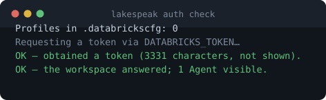
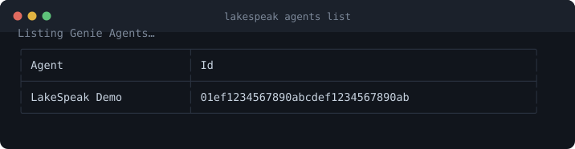
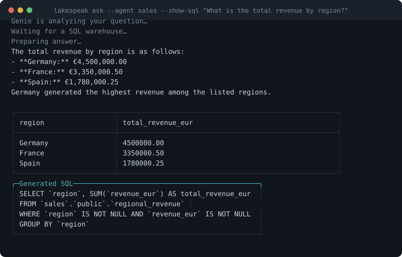
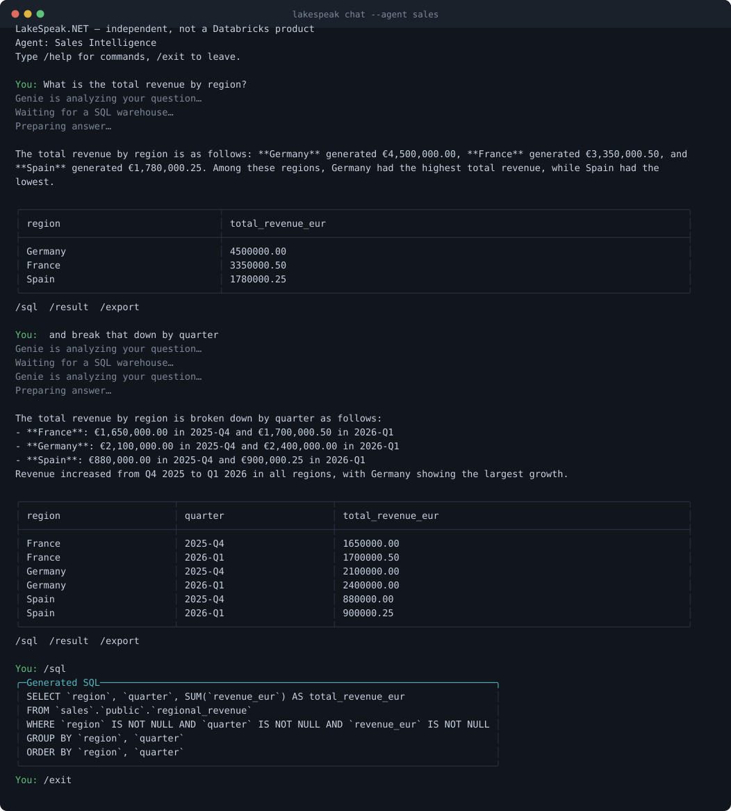

# Getting started

From nothing to a working answer. About ten minutes if your workspace already has a Genie Agent,
longer if someone else has to create one for you.

## What this actually is

**Databricks Genie** is a Databricks feature that answers questions about your data in plain
English. You ask "which customers churned last quarter", it writes SQL against tables someone has
curated for it, runs that SQL on a SQL warehouse, and answers. A **Genie Agent** — the REST API
still calls it a *space* — is one such configured question-answering surface: a set of tables, some
instructions, and a warehouse to run on.

Genie normally lives inside the Databricks web UI. **LakeSpeak puts it in your .NET code, and in
your terminal.** The .NET half is the part nothing else does — Databricks publishes SDKs for
Python, Java, Go and R, but not for .NET. For a terminal answer alone, `databricks genie ask` ships
with the Databricks CLI and is worth trying first.

```
   You                LakeSpeak              Databricks Genie
    │                     │                         │
    │  "revenue by        │                         │
    │   region?"          │                         │
    ├────────────────────►│  start conversation     │
    │                     ├────────────────────────►│
    │                     │                         │ generates SQL
    │                     │  poll until done        │ runs it on a warehouse
    │                     ├────────────────────────►│
    │  answer + the SQL   │                         │
    │◄────────────────────┤◄────────────────────────┤
```

LakeSpeak never sees your data except in transit, never stores a credential, and cannot see
anything your own Databricks identity cannot.

## What you need before you start

Three things, and the second is the one people get stuck on:

1. **A Databricks workspace** you can log into.
2. **A Genie Agent that exists and is shared with you.** LakeSpeak cannot create one — that is
   done in the Databricks UI under **Genie**, by someone who knows which tables should be
   queryable. If nobody has made one, this tool has nothing to talk to.
3. **The [Databricks CLI](https://docs.databricks.com/dev-tools/cli/install.html)**, for the login.
   You can skip it if you supply a token yourself (see [authentication](authentication.md)).

To check whether you have a Genie Agent at all, open your Databricks workspace and look for
**Genie** in the sidebar. If the list is empty, stop here and go and get one created — everything
below will otherwise fail at the last step with "no Genie Agents are visible to this identity",
which is accurate but not much comfort.

## 1. Install

```bash
dotnet tool install --global LakeSpeak.Cli
lakespeak --version
```

Needs the [.NET 10 runtime or SDK](https://dotnet.microsoft.com/download). If you would rather not
install .NET at all, each release also ships a self-contained binary for Windows, Linux and macOS —
see the [releases page](https://github.com/ivanvyd/LakeSpeak.NET/releases).

## 2. Log in

```bash
databricks auth login --profile my-workspace
```

That opens a browser once and caches a short-lived OAuth token. LakeSpeak borrows that token; it
never stores one of its own.

Check it worked:

```bash
lakespeak auth check --profile my-workspace
```

This tells you which profiles exist, which workspace each resolves to, whether a token can actually
be obtained, and whether the workspace answers. It prints the token's *length* and never any part
of its value, so the output is safe to paste into an issue.



## 3. Find your Agent

```bash
lakespeak agents list --profile my-workspace
```



An empty list is not an error — it means no Genie Agent is shared with your identity. That is fixed
in Databricks, not here.

## 4. Ask something

```bash
lakespeak ask --agent "Sales Intelligence" --show-sql "How did revenue change last quarter?"
```



Note `4500000.00` — not `4.5E6`, not `4,500,000`. Cells reach you exactly as Databricks returned
them; nothing is reparsed on the way out.

**Always read the SQL before acting on a number.** Generated SQL can be wrong in ways that read as
entirely correct — a subtly wrong join, a date boundary off by one, a filter that quietly excludes
cancelled orders. `--show-sql` exists for exactly this, and LakeSpeak preserves the statement, the
bound values and the message ids precisely so you can check.

## 5. Keep talking

```bash
lakespeak chat --agent "Sales Intelligence"
```

Follow-up questions keep their context, so "and break that down by product" works. Type `/help`
for the slash commands, `/sql` to see the statement behind the last answer, `/export report.csv`
to save the result, `/exit` to leave.



`chat` needs a real terminal. For scripts, use `ask`.

## Where to go next

| You want to | Read |
|---|---|
| Script this, or pipe it into another tool | [Commands](commands.md) — every flag and exit code |
| Use it from C# | [In .NET](#using-it-from-net) below |
| Run the same questions on a schedule | [Question Packs](question-packs.md) |
| Understand what it will not do | [Limitations](limitations.md) — worth reading early |
| Something broke | [Troubleshooting](troubleshooting.md) |

## Scripting it

Results go to stdout, diagnostics to stderr, so this works cleanly:

```bash
lakespeak ask --agent finance --format json "Recognized revenue yesterday?" 2>/dev/null \
  | jq -r '.result.rows[][]'
```

```powershell
$r = lakespeak ask --agent finance --format json "Revenue yesterday?" | ConvertFrom-Json
$r.result.rows
```

Exit codes are contractual — `0` success, `2` bad input, `3` auth, `4` permission, `5` not found,
`7` timeout. The full table is in [commands.md](commands.md).

## Using it from .NET

```bash
dotnet add package LakeSpeak.Genie
```

```csharp
using LakeSpeak.Genie;
using Microsoft.Extensions.DependencyInjection;

var services = new ServiceCollection();
services.AddLakeSpeak(options => options.Profile = "my-workspace");

using var provider = services.BuildServiceProvider();

// Configuration is validated here, when the client is first resolved — not on the first call.
// With no host reachable from the options, the environment or .databrickscfg, this throws
// OptionsValidationException: "No Databricks host configured." That is a startup failure,
// not a GenieException, so it is deliberately outside the catch blocks below.
var genie = provider.GetRequiredService<IGenieClient>();

try
{
    var response = await genie.AskAsync(
        agentId: "01ef1234567890abcdef1234567890ab",
        question: "Which customers had the largest revenue decline?",
        cancellationToken: ct);

    Console.WriteLine(response.Text);

    // The SQL, and the values bound into it, so a human can check the answer.
    if (response.Query is { Sql: { } sql })
    {
        Console.WriteLine(sql);
    }

    // Cells are strings exactly as Databricks returned them — a DECIMAL is never
    // round-tripped through a double on its way to you. Convert deliberately.
    foreach (var row in response.Result?.Rows ?? [])
    {
        Console.WriteLine(string.Join(" | ", row));
    }

    if (response.Result?.IsTruncated == true)
    {
        Console.WriteLine("This result is incomplete — narrow the question.");
    }
}
catch (GenieException ex) when (ex.Kind == GenieFailureKind.Authorization)
{
    // Your identity cannot use that Agent, or cannot read a table behind it.
    // Fixed with a Databricks grant, not in code.
}
catch (GenieException ex) when (ex.Kind == GenieFailureKind.PollingTimeout)
{
    // Usually a cold SQL warehouse. ex.LastKnownResponse tells you how far it got.
}
```

Every failure arrives as a `GenieException` with a `Kind` you can branch on — see
[`GenieFailureKind`](../src/LakeSpeak.Genie/GenieFailures.cs). Ask follow-ups with
`FollowUpAsync(agentId, conversationId, question)`.

For a host that already has its own OAuth flow, register a token provider before `AddLakeSpeak`:

```csharp
services.AddGenieTokenProvider(async ct => await myTokenSource.GetAsync(ct));
```

Full detail in the [authentication guide](authentication.md).

A complete runnable version of this is at
[`examples/dotnet-quickstart`](../examples/dotnet-quickstart/), built in CI so it cannot drift
from the library:

```bash
dotnet run --project examples/dotnet-quickstart -- <agent-id> "How many rows are there?"
```
